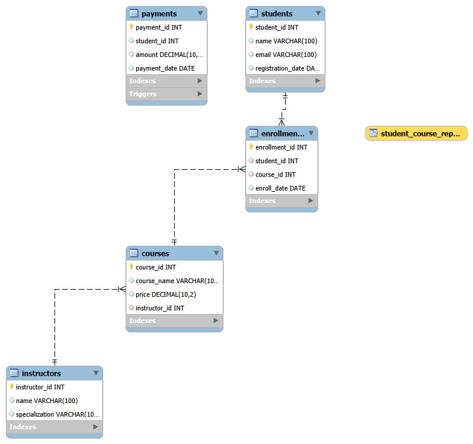

# Course Management System Database (MySQL)

This project demonstrates the design and implementation of a relational database for managing an online course platform using MySQL.

## Features
- Relational database design with multiple interconnected tables
- SQL joins for retrieving related data
- Aggregate queries for data analysis
- View for reporting
- Stored procedure for reusable database logic
- Trigger for automated database operations

## Database Tables
- students
- instructors
- courses
- enrollments
- payments

## SQL Concepts Used
- Primary Keys
- Foreign Keys
- JOIN
- GROUP BY
- Aggregate Functions (SUM, COUNT, AVG)
- Views
- Stored Procedures
- Triggers

## Example Queries
- Find students enrolled in courses
- Calculate total revenue from payments
- Identify courses taught by instructors
- Count number of students in each course

## Technologies Used
- MySQL (Relational Database Management System)
- SQL (Query Language)
- MySQL Workbench (Database Client Tool)
- ## Database Schema

